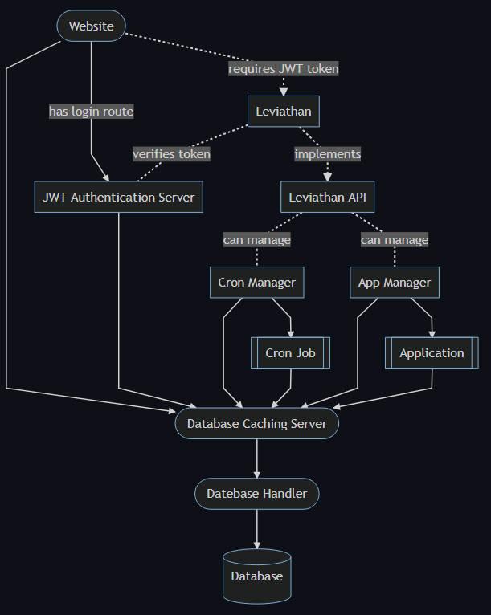

# Leviathan
Leviathan is platform for me to deploy applications and cron jobs with ease. It will be built with containers in mind for, so the platform can be scalable.

# Diagrams
All diagrams are made with [mermaid](https://mermaid-js.github.io/mermaid/#/).

Command for generating mermaid images:
```bat
mmdc -t dark -b #0d1117 -i inputfile.mmd -o outputfile.png
```

Rounded nodes indicates they are scalable.

## Domain


# Technologies
The primary technology that will be used is [Docker](https://www.docker.com/). This will allow me to create all the modules (nodes) independently and with their own technology.

> To implement the scalability, I will most likely either use [Docker Swarm](https://docs.docker.com/engine/swarm/) or [Kubernetes](https://kubernetes.io/). Both are yet to be researched, so a final conclusion has not been made.

These was my initial thoughts. I have now concluded the project will use Kubernetes, because support for Docker Swarm will come to a halt in the comming years.