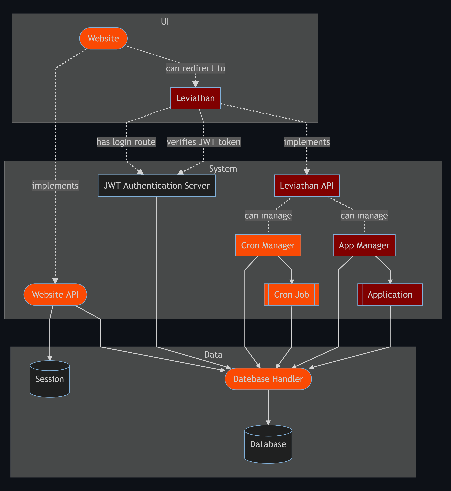

# Leviathan
Leviathan is a platform for me to deploy applications and cron jobs with ease. It will be built with containers in mind, so the platform can be scalable.

I've taken a lot of inspiration from [Devon Crawford](https://www.youtube.com/channel/UCDrekHmOnkptxq3gUU0IyfA), especially [this video](https://www.youtube.com/watch?v=SC7lLm6QAb8).

# Diagrams
All diagrams are made with [mermaid](https://mermaid-js.github.io/mermaid/#/).

Command for generating mermaid images:
```bat
mmdc -t dark -b #0d1117 -s 5 -i inputfile.mmd -o outputfile.png
```

## Domain


If a module (node) has rounded corners, it indicates it is scalable.

The modules are colored in the way that red modules are yet to be worked on, orange modules are in progress, and no color is finished.

---

This diagram consists of 3 groups, UI, System and Data.

The UI group will be what the user sees, but it will also include minimal logic in the form of a sign in feature.

All the other logic modules are in the System group. These modules consists mostly of API's, but there are also other low level system modules.

For all the data that will horde up in all the modules, the Data group will manage all of it.

# Technologies
The primary technology that will be used is [Docker](https://www.docker.com/). This will allow me to create all the modules independently and with their own technology.

> To implement the scalability, I will most likely either use [Docker Swarm](https://docs.docker.com/engine/swarm/) or [Kubernetes](https://kubernetes.io/). Both are yet to be researched, so a final conclusion has not been made.

These were my initial thoughts. I have now concluded the project will use Kubernetes, because support for Docker Swarm will come to a halt in the comming years.

# Modules
In this section, I will be describing all the modules and what their purpose for the project is.

## Website
The website will hold a frontend for my public projects and be the link to Leviathan. The website will also have an API to communicate securely with the Database Handler.

## JWT Authentication Server
This server will handle all authentication for Leviathan with the industry standard [RFC 7519](https://jwt.io/) protocol.

## Leviathan
Leviathan is the "administration" page for all my future needs. It will have a dedicated API that will communicate with the Cron and App Manager.

## Cron and App Manager
The Cron and App Managers job is to handle the management of the Cron Jobs and Applications. The tasks will include booting, deletion, activation, deactivation and whatever else I come up with.

## Database Handler
This servers responsibility is to handle requests to the database and cache data that is frequently used.

Initially my plan was to have a dedicated database handler and caching server, but after learning more about [Redis](https://redis.io/), I've decided to merge the two modules into a single module.

Command for Redis nodes:
```bash
docker run --name leviathan-redis -p 6379:6379 -d redis redis-server --appendonly yes
docker run --name leviathan-session-redis -p 6380:6379 -d redis redis-server --appendonly yes
```